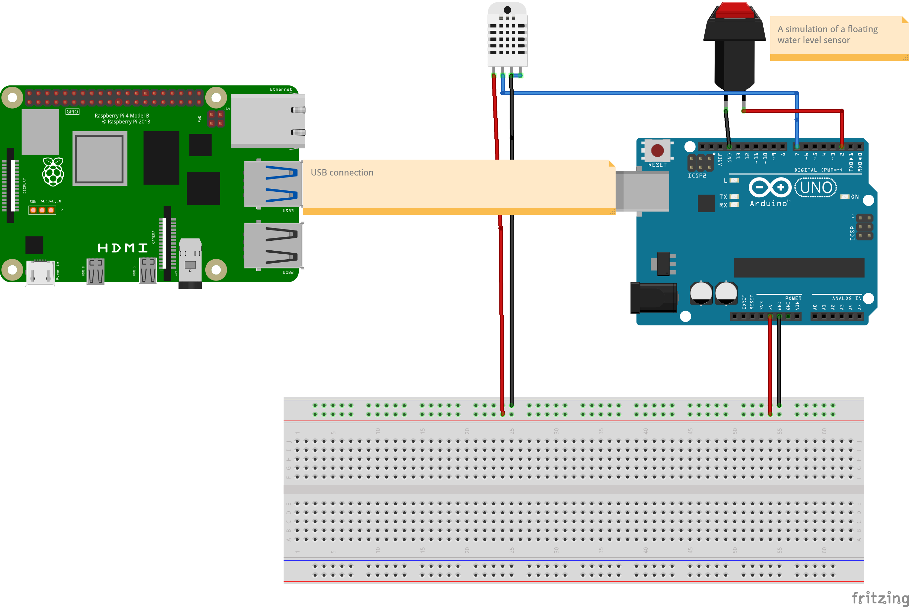

# Instructions

## Purpose of this project
The purpose of this project is to manage the parameters of my pet that is a snake.
 
The data that will be processed is going to be the temperature and humidity with a dht22 sensor, the water level in his container and an automatic system for spreading water in order to humidify the terrarium every time the humidity is over 50%.
 
Also the water will be warm with another sensor for keep warm the reserve of water.
  

## Rasp Berry python program
The user interface will be developed with python using electron with flask microframework for the graphic interface in order to show all the data we need with an interface which is builded with css.
 
The program will process the data that comes from the arduino via USB and the python program will be processing this data.
All this in order to be showed through a display connected to the raspberry.
 

### Installation, libraries and considerations
* For its correct installation and use you need first python3 the version 3 or higher.
* The project uses Ubuntu mate OS for the raspberry.
* The model of the raspberry is pi4 B+.
* USB cable for connect both boards between them.
* Use pip3 install -r requirements.txt in order to install all python libraries needed.
  

## Arduino program
The Arduino is used in order to acquire the parameters we want to show through the LCD that is humidity and temperature.
 
The part of the water sensor level is not showed in the LCD, this is measured internally in order to let the arduino know when the arduino needs to turn on the buzzer.

### Installation, libraries and considerations
* First you need to use an Arduino uno board in order to use the same pins as the program, if not consider that you will need to change the default pins.
* You need the IDE of Arduino for upload the Arduino program to your board.
* You need to install from the IDE the dht.h library from adafruit in order to read the dht sensor and include it in the program.
* Include LiquidCrystal.h library for write in screen the temperature and humidity.
* If you´re using s linux distribution to upload the file to the Arduino remember to enable the permissions of writing over the USB port.
* The water level sensor has an analog output, verify the behaviour of your sensor and change the minimum value that corresponds to the variable named: valor in the part of the if´s.

## Sensor´s and materials list used
* dht22 humidity and temperature sensor
* Horn of 2 inches of 1.5 watts
* Water float sensor
* Raspberry pi 4 B+
* LCD touch display of 7 inches
* 256 gb SD
* 3 relays
* 1 L293D chip

## Connection diagram
Here is going to appear the way you need to connect the arduino with the raspberry

  

# More instructions are going to be uploaded with the time
