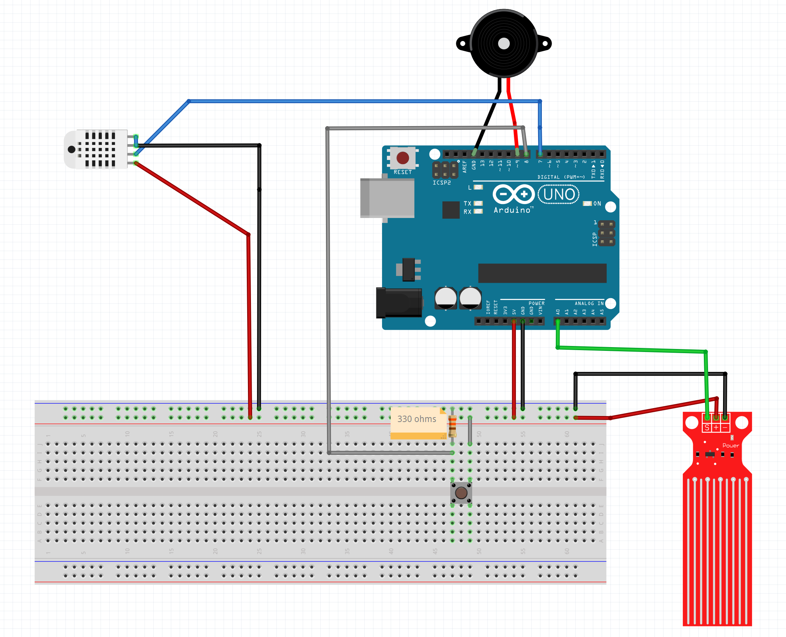

# Instructions

## Purpose of this project
The purpose of this project is to manage the parameters of my pet that is a snake.
 
The data that will be processed is going to be the temperature and humidity with a dht22 sensor, the water level in his container and an automatic system for spreading water in order to humidify the terrarium every time the humidity is over 50%.
 
Also the water will be warm with another sensor for keep warm the reserve of water.
  

## Rasp Berry python program
The user interface will be developed with python using pygtk library for the graphic interface in order to show all the data we need.
 
The program will process the data that comes from the arduino via USB and the python program will be processing this data.
All this in order to be showed through a display connected to the raspberry.
 

### Installation, libraries and considerations
* For its correct installation and use you need first python3 the version 3 or higher.
* The project uses Ubuntu mate OS for the raspberry.
* The model of the raspberry is pi4 B+.
* USB cable for connect both boards between them.
  

## Arduino program
The arduino will be used as a data acquisition board and will process all the data and results of the sensors.
 
All this data will be sended via bluetooth to the rasp berry´s program so it can be shown through the screen of the reaspberry.

### Installation, libraries and considerations
* First you need to use an Arduino uno board in order to use the same pins as the program, if not consider that you will need to change the default pins.
* You need the IDE of Arduino for upload the Arduino program to your board.
* Install from the IDE the dht.h library from adafruit in order to read the dht sensor and include it.
* Include in the arduino program the library: SoftwareSerial.h in order to read and send data from the bluetooth module.
* If you´re using s linux distribution to upload the file to the Arduino remember to enable the permissions of writing over the USB port.

## Sensor´s and materials list used
* dht22 humidity and temperature sensor
* Active buzzer
* Water level sensor HR0043 or similar
* 1 push button
* Arduino uno
* Raspberry pi 4 B+
* LCD touch display of 7 inches
* HDMI cable
* USB cable type A to type B of arduino
* 256 gb SD
* 330 ohms resistor

## Conecction diagram
Version 1 of the diagram connection

  

# More instructions are going to be uploaded with the time
