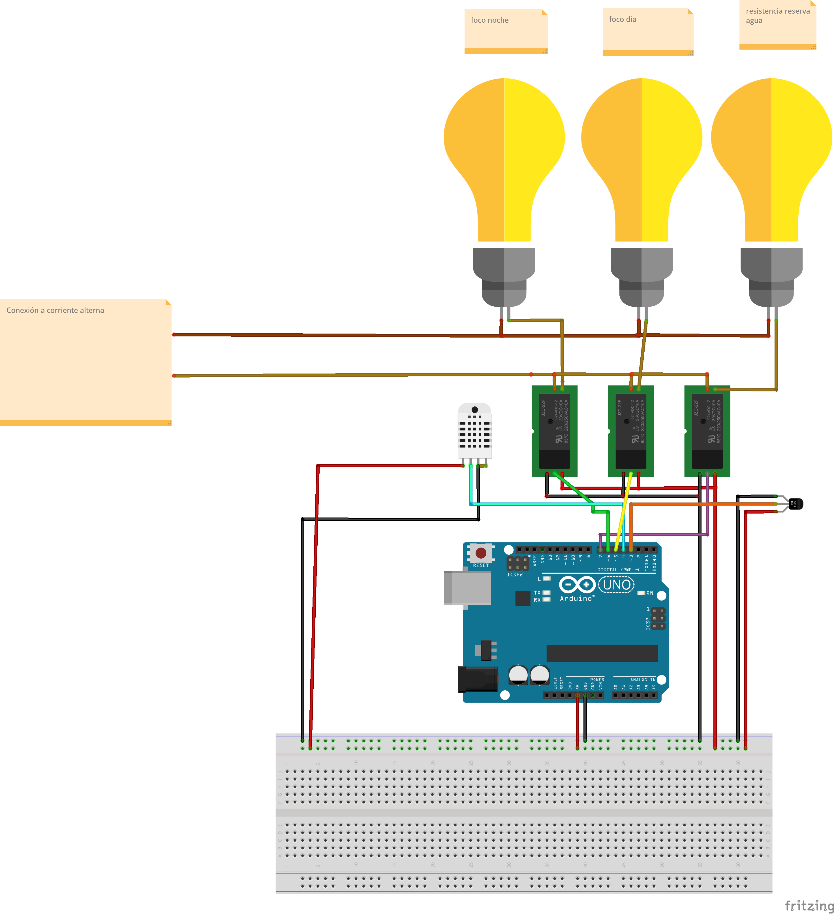

<p align="center">
  
  <h1 align="center" style="margin: 0 auto 0 auto;">Smart terrarium</h1>
  <h5 align="center" style="margin: 0 auto 0 auto;">Smart terrarium for your reptile pets</h5>
</p>

<p align="center">
    
    
    
    
</p>

## The project
The purpose of this project is to manage the parameters of reptile pets.
<br>
A project that is used for creating a smart terrarium for your reptile pets. This project is for managing all parameters that the reptile needs in order to have a great life.
<br>
This is a smart things project that has a manual and automatic mode so you can manage the terrarium as you prefer.
<br><br>

## Documentation
We are developing a github page in the wiki part in order to use that space as a documentation, that documentation page will be builded with the time but all code has comments in order to be used as documentation for each method created in the project just for now. [Click here](https://github.com/dmtzs/ProyectoRaspArduino/wiki) in order to go to that documentation page.
<br>
Also please see below the list of the hardware which are going to be used in this project.

## Mobile Application kotlin program
This mobile app will have the same functionality like the desktop app, with the difference that you will now control the main app executed in the raspberry through this mobile app from anywhere if you need it.
<br>
This mobile app will be developed with the time after most of the main app of the raspberry is finish.
<br>
If you want to see the repository [click here](https://github.com/dmtzs/TerrariumMobileApp) to go to the repository of the mobile app of the terrarium.

## Rasp Berry python program
The user interface will be developed with python using electron and flask microframework for the graphic interface in order to show all the data we need with an interface which is builded with css and of course the flask is for all the connections and instructions with the Arduino.
<br>
The program will process the data that comes from the arduino via USB and the python program will be processing this data.
All this in order to be showed through a display connected to the raspberry.
<br>

### Installation, libraries and considerations
* For its correct installation and use you need first python3 installed in your raspberry.
* The project uses Ubuntu mate OS(arm64 bits version).
* The model of the raspberry is pi4 B+.
* You can use raspberry models like pi3 and pi3 B but are not still tested in this ones.
* USB cable for connect both boards between them.
* Execute the command below in order to install all python libraries and all configuration needed for this project and to create the flask executable. Also the flag --help will give you the same instructions about which flags are allowed by the program InstalacionBase python file
```
python3 InstalacionBase.py --help
```

## Arduino C++ program
The Arduino is used in order to acquire the parameters we want to show through the LCD of the raspberry and also receive data from the raspberry to do some actions with the arduino.
<br>
All the necesary data will be displayed in the display of the raspberry for its correct manage from the user.

### Installation, libraries and considerations
This libraries should be installed only if you want to develop by yourself the arduino, if not it is not neccesary.
* First you need to use an Arduino uno board in order to use the same pins as the program, if not consider that you will need to change the default pins.
* You need the IDE of Arduino for upload the Arduino program to your board.
* You need to install from the IDE the dht.h library from adafruit in order to read the dht sensor and include it in the program.
* You need to install from the IDE the OneWire.h library from Paul Stoffregen to read the submersible sensor.
* You need to install from the IDE the DallasTemperature.h library from Miles Burton in order to be use with OneWire library.
* If you´re using s linux distribution to upload the file to the Arduino remember to enable the permissions of writing over the USB port.

## Sensor´s and materials list used
* dht22 humidity and temperature sensor
* DS18B20 submersible sensor
* Horn with auxiliar connection(if you want)
* Water float sensor
* Raspberry pi 4 B+
* LCD touch display of 15.6 inches
* 256 gb SD
* 3 relays
* 1 L298D chip (H bridge)
* 1 pression water bomb of 12 volts
* 1 coffe maker water bomb of 12 volts
* 1 water resistor for keeping warm the reserve of water
* 1 night bulb
* 1 day bulb

## Connection diagram
Here is the diagram connection about how you need to connect all components, to which pin´s, etc.


<br><br>

# The project is open and still on development
